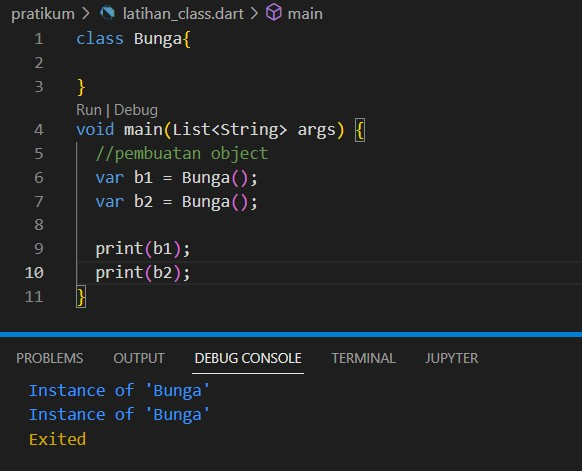

# (10) Dart Objek Oriented Programming 1 
## Data Diri 
Nomor Urut : 1_009FLB_38 <br>
Nama : Farischa Makay <br>
## Summary
### Perkenalan Object Oriented Programming
Object Oriented Programming(OOP) adalah paradigma pemrograman yang berkonsep object. Maksudnya ialah kita dapat memvisualisasikan object di dunia nyata ke dalam program komputer. Dalam OOP kita dapat menyusun program dalam bentuk abstraksi object, dimana kita bisa menampilkan atribut/properti yang relevan saja dan menyembunyikan detailnya. Data dan proses juga diletakkan pada abstraksi tersebut. <br>
Keuntungan OOP yaitu Mudah di troubleshot. Ketika terjadi error pada program kita bisa mengetahui letak error tanpa memeriksa baris per baris setiap code. Kemudian OOP juga mudah digunakan ulang. Beberapa Object memiliki kesamaan ciri - ciri dan perilaku sehingga kita tidak perlu membangun ulang ciri-ciri dan perilaku tersebut disetiap object yang ada pada program. Selain Dart penggunaan OOP bisa ditemukan pada bahasa pemrograman lai  seperti C++, Java, Javascript, dan Python. OOP memiliki komponen antara lain yaitu Class, Object, Property, Method, Inheritance, Generics. 
### Class
Class merupakan abstraksi, gambaran, blue print dari sebuah benda(object). Class memiliki ciri-ciri yang disebut property. Dan didalam class juga memiliki sifat dan kemampuan yang disebut method. Pada pembuatan Class kita menggunakan kata kunci ```class``` yang diikuti dengan nama classnya yang diawali oleh huruf capital. Untuk setiap property dan method pada class, diletakkan dalam tanda kurung kurawal. <br> 
Dari Class yang dibuat kita dapat membuat object dari class tersebut, kita dapat menyimpan object dalam sebuah variabel yang bisa disebut sebagai instance of class. Object perlakukan seperti data dalam program. Berikut contoh code pembuatan class <stronng>Bunga</strong>
 <BR>
Code diatas merupakan contoh pembuatan class dengan nama Bunga dan object yang dibuat yaitu b1 dan b2.
### Property
Property merupakan ciri-ciri suatu class atau hal-hal yang dimiliki suatu class untuk menggambarkan suatu object contohnya seperti nama, usia berat badan, dan lain-lain. Property memiliki sifat seperti variabel dimana ketika kita membuat proerty kita perlu menentukan tipe data dan menginisialisasikan nilainya secara explicit ataupun nullable dengan memberi tanda tanya setelah tipe datanya. contoh sebagai berikut :
 <br>
untuk mengakses property sama caranya seperti menggunakan variabel tapi melalui sebuah object.

### Method
Method merupakan sifat suatu Class seperti aktivitas yang dapat dikerjakan suatu class. Contohnya Hewan yang bisa bersuara, makan, tidur, dan lain-lain. Method merupakan function yang terdapat pada suatu class. Untuk membuat method kita dapat membuat method didalam sebuah class dan untuk menjalankan method dapat dijalankan melalui sebuah object. Contohnya sebagai berikut : <br>
 <br>
Pada contoh code diatas kita dapat melihat untuk kelas Kucing kita akan panggil method mengaum dengan cara kita membuat object untuk memanggil methodnya.