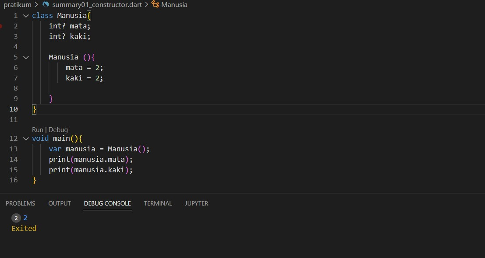
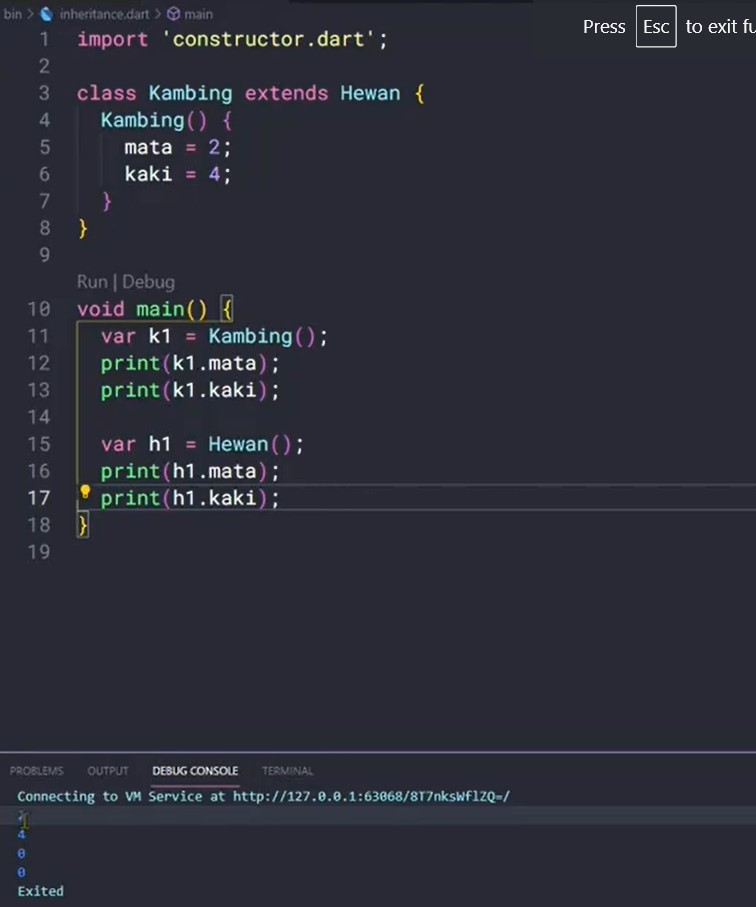

# (11) Dart Objek Oriented Programming 2 
## Data Diri 
Nomor Urut : 1_009FLB_38 <br>
Nama : Farischa Makay <br>

## Summary
Pada section 11 ini saya belajar mengenai Constructor, Inheritance, Method Overriding, Interface, Abstrak Class, Polymorphism, dan Generics. <br>
### Constructor
Constructor digunakan untuk mengontruksi object baru dan constructor merupakan fungsi atau method yang dijalankan saat pembuatan object. Sama seperti method constuctor juga dapat menerima parameter namun constructor tidak memiliki return value. Suatu constructor juga akan memiliki nama yang sama dengan nama class. Contohnya sebagai berikut : <br>
 <br>

### Inheritance 
Inheritance atau pewarisan adalah kemampuan suatu program membuat class baru dengan memanfaatkan class yang sudah ada. Inheritance dapat dibayangkan seperti seorang anak mewarisi sifat dari orang tuanya, dimana yang diwarisi bisa disebut sebagai class anak dan yang class yang mewatiskan disebut dengan class induk. Hal tersebut bertujuan agar kemampuan class yang sudah ada(class induk) dapat dimiliki oleh class baru(class anak). Pembuatan inheritance dibuat dengan menambahkan keyword ```extends``` saat pembuatan class baru. Contoh : <br>



### Method Overriding
Method overriding merupakan kemampuan untuk menulis ulang method yang ada pada super-class atau class induknya dan bertujuan agar class memiliki method yang sama, namun dengan proses yang berbeda. Saat melakukan overriding ada beberapa hal yang perlu diperhatikan, yakni : <br>
-. Dilakukan pada class yang melakukan inheritance <br>
-. Method sudah ada pada class induk <br>
-. Method ditulis ulang seperti membuat method baru pada class anak. <br>
Proses membuat object dari class yang terjadi inheritance seperti object pada umumnya. <br>

### Interface
Interface berupa class yang menunjukkan method apa saja yang ada pada suatu class. Kemudian seluruh method wajib di-override. Interface digunakan dengan menggunakan implements. Saat menggunakan interface ada beberapa hal yang perlu diperhatikan, yakni : <br>
-. Pada class yang melakukan implements, wajib melakukan override semua method yang ada pada class induk. <br>
-. Interface sekilas mirip inheritance. Proses membuat object dari class yang terjadi inheritance seperti pembuatan object pada umumnya. <br>
### Abstrak Class
Abstrak class merupakan class yang berupa abstrak yang menunjukkan method apa saja yang ada pada suatu class. Abstrak class digunakan dengan menggunakan extends, tidak dapat dibuat object dan tidak semua method harus di-override.
### Polymorphism
Polymorphism merupakan kemampuan data berubah menjadi bentuk lain. Tipe data yang dapat digunakan adalah super class. Polymorphism dapat dilakukan pada class dengan extends atau implements. 

### Generics
Generics dapat digunakan pada class dan fungsi. Generics memberi kemampuan agar dapat menerima data dengan tipe yang berbeda. Tipe data yang diinginkan, ditentukan saat membuat class atau menjalankan fungsi. Membuat class dengan generics dapat memerhatikan hal-hal berikut : <br>
-. Class hadiah dapat dimasukkan data dengan tipe T. <br>
-. Tipe T dapat digunakan di seluruh class hadiah. <br>
-. Setelah nama class, menjadi tempat tipe data yang diinginkan. <br>
Membuat fungsi dengan generics dengan cara setelah nama fungsi menjadi tempat variabel generics dan tempat tipe data yang diinginkan. 


