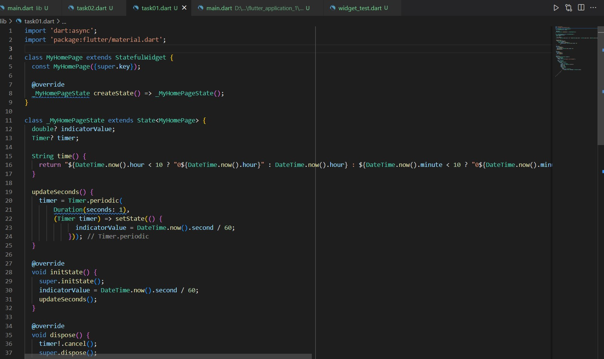
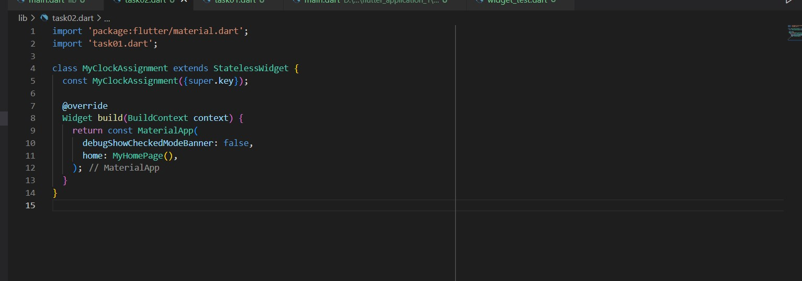

# (12) Introduction Flutter Widget 
## Data Diri 
Nomor Urut : 1_009FLB_38 <br>
Nama : Farischa Makay <br>

## Task

Pada section ini tugas yang diberikan ialah mengenai project clock, dimana program akan menampilkan jam, menit, dan detik secara dinamis. Project pada tugas ini saya beri nama ```task_clock_application``` berikut demo hasil pengerjaan project : <br>

### Task01
Pada tugas pertama dengan perintah pembuatan statefulwidget saya buat pada file ```task01.dart```. Dengan kodingan seperti berikut :<br>
 <br>

### Task02
Pada task kedua saya memisahkan widget stateless widget dari statefulwidget. Berikut kodingan implementasinya : <br>
