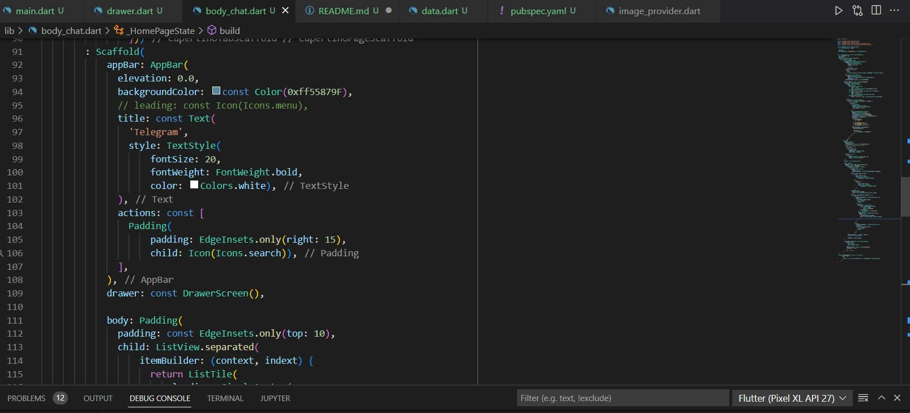

# (13) Platfrom Widget
## Data Diri 
Nomor Urut : 1_009FLB_38  
Nama : Farischa Makay  

## Task
Pada section 13 Platform Widget ini terdapat 2 assignment mengenai pembuatan UI Telegram.

### Task 01
Pada task 01 ini ialah tampilan UI Telegram android, dimana saya menggunakan Material Design saat proses pembuatan.  
  
Hasil dari program apabila dijalankan sebagai berikut:  

### Task 02
Task 02 juga sama seperti task 01 hanya saja dibuild menggunakan cupertino.  

Hasil dari program apabila dijalankan sebagai berikut:  

