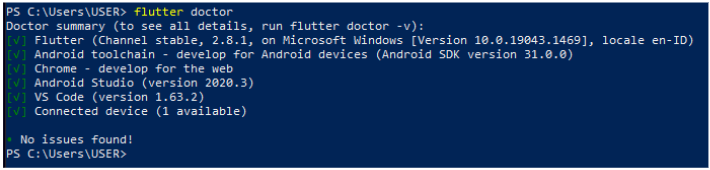
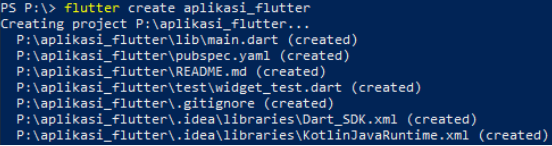
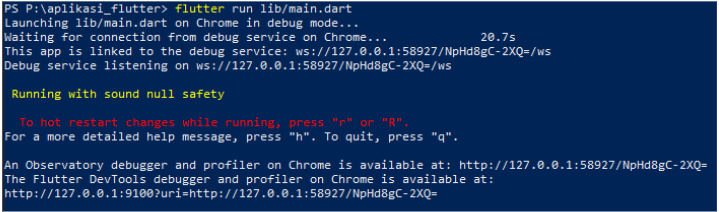
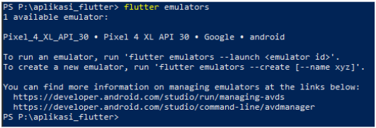
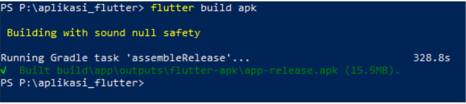
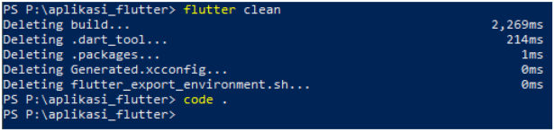

# (14) Flutter Command Line Interface (CLI) and Flutter package management

## Data Diri
Nomor Urut : 1_009FLB_38 <br>
Nama : Farischa Makay

## Summary
### Flutter CLI
Command Line Interface (CLI) ialah alat yang digunakan untuk berinteraksi dengan Flutter SDK yang ditulis dan dijalankan dalam terminal.
### Important CLI Commands
- Flutter Doctor, yakni perintah untuk menampilkan informasi software yang dibutuhkan flutter. <br>
 
- Flutter Create, yakni perintah untuk membuat project aplikasi flutter baru di directory tertentu. <br>

- Flutter Run, yakni perintah untuk menjalankan project aplikasi di device yang tersedia. <br>

- Flutter Emulator, yakni perintah untuk menampilkan daftar emulator yang terinstall dan menampilkan option untuk membuka emulator atau membuat emulator baru. <br>

- Flutter Channel, yakni perintah untuk menampilkan daftar flutter channel yang tersedia dan menunjukkan channel yang digunakan saat ini. <br>
- Flutter Pub, perintah flutter pub ada 2 yang bisa digunakan yakni flutter pub add( ```flutter pub add <package_name>``` perintah untuk menambahkan packages ke depedencies yang ada di pubspec.yaml) dan flutter pub get( ```flutter pub get``` perintah untuk mendownload semua packages atau dependencies yang ada di pubspec.yaml).
- Flutter Build, yakni perintah untuk memproduksi sebuah file aplikasi untuk keperluan deploy atau publish ke AppStore, PlayStore, dll. <br>

- Flutter Clean, yakni perintah untuk menghapus folder build serta file lainnya yang dihasilkan saat kita menjalankan aplikasi di emulator. Perintah ini akan memperkecil ukuran project tersebut. <br>

### Packages Management
Flutter mendukung sharing packages yang dibuat developers lain. Packages berfungsi untuk mempercepat pengembangan aplikasi karena tidak perlu membuat semuanya dari awal atau from scratch. Untuk mendapatkan packages kita bisa mencarinya di website <strong>pub.dev. </strong>
Cara untuk menambahkan packages antara lain :
- Cari package di pub.dev
- Copy baris dependencies yang ada di bagian installing
- Buka pubspec.yaml
- Paste barisnya dibawah dependencies pubspec.yaml
- Run flutter pub get di terminal
- Import package di file dart agar bisa digunakan 
- Stop atau restart aplikasi jika dibutuhkan.