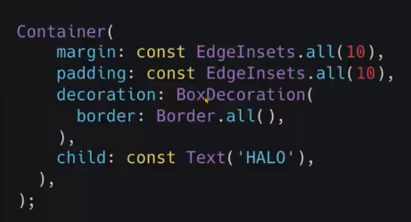
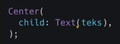
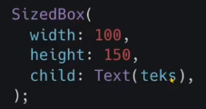

# (15) Flutter Layout

## Data Diri
Nomor Urut : 1_009FLB_38  
Nama : Farischa Makay

## Summary
### Apa itu flutter layout?
Layout digunakan untuk mengatur tata letak pada tampilan layar aplikasi. Layout berbentuk widget yang mengatur widget di dalamnya.
### Single child layout
Sesuai namanya widget single child layout hanya memiliki satu buah child saja. Contohnya seperti Container, Center, Sizebox. 

- Container, container memberikan tampilan seperti sebuah box, dapat membungkus widget lain. Sebuah box memiiki margin, padding dan border.  Contoh :  

- Center, widget center akan memenuhi lebar dan tinggi ruang diluarnya dan membungkus widget lain sebagai childnya. Setiap widget yang menjadi child dari widget center maka widget itu akan di letakkan di bagian tengah.  Contoh :  

- Sizebox, widget sizebox lebih sederhana dari container. Box dapat diatur lebar dan tingginya dan membungkus widget lain. Contoh :  

### Multi child layout
Multi child layout digunakan ketika kita ingin membuat widget lebih dari satu dan akan menggunakan properti children bertipe array widget. Untuk pembuatan kita dapat menggunakan Column, Row, ListView, GridView.
- Column untuk mengatur widget secara vertikal.
- Row untuk mengatur widgets secara horizontal.
- ListView untuk mengatur widget dalam bentuk list dan memiliki kemampuan scroll.
- GridView untuk mengatur widgets dalam bentuk galeri.