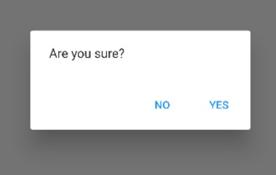
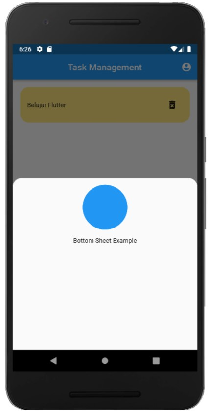

# (19) Dialog Bottom Sheet 
## Data Diri
Nomor Urut : 1_009FLB_38 <br>
Nama : Farischa Makay

## Summary
Pada section kali ini, saya belajar mengenai Dialog & Bottom Sheet.

### Alert Dialog
Alert dialog ini berfungsi untuk menginformasikan pengguna tentang situasi tertentu dan juga dapat digunakan untuk mendapatkan input dari user.Untuk tampilan android, kita dapat menggunakan material design. Dalam menampilkan dialog dengan membutuhkan helper method showDialog. Cara membuat alert dialog dengan memanggil fungsi showDialog di dalam fungsi onPressed. showDialog membutuhkan context dan builder. Di buildernya akan mereturn AlertDialog. AlertDialog menyediakan properti seperti content dan actions. Content bisa ditambahkan button untuk menerima respon dari user. Kemudian yang terakhir kita dapat menambahkan method ```Navigator.pop(context)``` dan ```ScaffoldMessenger```. <br>


### Bottom Sheet
Bottom sheet memiliki kesamaan dengan dialog hanya saja bottom sheet muncul dari bawah. Untuk membuat Bottom Sheet kita menggunakan fungsi bawaan flutter showModalBottomSheet dan juga membutuhkan dua properti yaitu context dan builder. Contoh hasil Bottom sheet <br>


