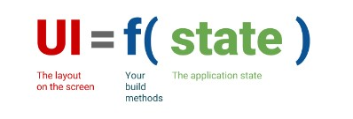

# (22) Flutter State Management(Bloc)
## Data Diri
Nomor Urut : 1_009FLB_38  
Nama : Farischa Makay

## Summary
Pada section kali ini, saya belajar mengenai State Management.

### Declarative UI
Flutter memiliki sifat declarative yang artinya flutter membangun UInya pada screen untuk mencerminkan keadaan state saat ini.  
  
State adalah ketika sebuah widget sedang aktif dan widget tersebut menyimpan data di memori. Flutter akan membangun ulang UInya ketika adad state atau data yang berubah. Ada 2 jenis state dalam flutter, ephemeral state dan app state. 
- Ephemeral state. State ini digunakan ketika tidak ada bagian lain pada widget tree yang membutuhkan untuk mengakses data widgetnya. Contohnya : PageView, BottomNavigationBar, Switch Button. State ini tidak perlu state management yang kompleks, hanya membutuhkan StatefulWidget dengan menggunakan fungsi setState().
- App State. State ini digunakan ketika bagian yang lain suatu aplikasi membutuhkan akses ke data state widget. Contohnya : Login info, pengaturan preferensi pengguna, keranjang belanja yang dimana informasi yang pengguna pilih di suatu screen yang mana informasi itu akan muncul di screen yang berbeda.  
Pendekatan State Management terbagi menjadi 3 yaitu setState, Provider dan Bloc.
### setState
setState lebih cocok penggunaannya pada ephermeral state
### Provider
Penggunaan untuk state management yang lebih kompleks seperti app state, pendekatan ini direkomendasikan oleh tim flutter karena lebih mudah dipelajari
### Bloc
Menggunakan pola stream/observable, untuk memisahkan UI dengan bisnis logicnya.
