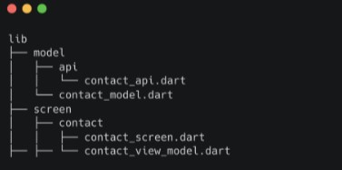
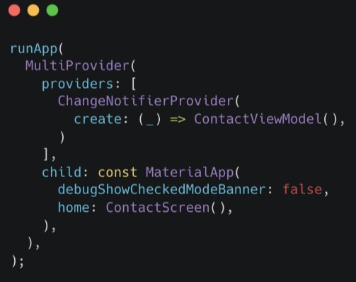

# (26) MVVVM Architecture
## Data Diri
Nomor Urut : 1_009FLB_38  
Nama : Farischa Makay

## Summary
Pada section kali ini, saya belajar mengenai MVVM Architecture.

### MVVM Architecture
MVVM merupakan singkatan dari Model-View ViewModel yang memisahkan logic dengan tampilan(View) ke dalam ViewModel.

### Keuntungan yang didapat
Keuntungan penggunaan dari penerapan MVVM sebagai berikut :
- Reusability. Jika ada beberapa tampilan yang memerlukan alur logic yang sama, mereka bisa menggunakan ViewModel yang sama.
- Maintainability. Mudah dirawat karena pekerjaan terkait tampilan tidak tertumpuk bersama logic.
- Testability. Pengujian menjadi terpisah antara pengujian tampilan dengan pengujian logic, sehingga dapat meningkatkan produktivitas pada pengujian.

### Melakukan MVVM
MVVM memiliki struktur direktori sebagai berikut : 

dengan model memiliki 2 bagian, yaitu bentuk data yang akan digunakan dan sumber dari data tersebut. Tiap screen dalam sebuah direktori didalamnya terdapat View dan ViewModel. Model merupakan bentuk data yang akan digunakan, dibuat dalam bentuk class. Data-data yang dimuat diletakkan pada property.  
<bold>ViewModel>
</bold> digunakan untuk menyimpan data-data dan logic yang diperlukan halaman screen jika widget lain memerlukan logic yang sama maka ViewModel dapat digunakan juga. Untuk mendaftarkan ViewModel menggunakan MultiProvider seperti berikut :  
  
dengan MaterialApp sebagai child utama.  
<bold>View</bold> menggunakan statefulwidget. Untuk menampilkan data, data diletakkan pada build dan menggunakan getters yang ada pada ViewModel.
