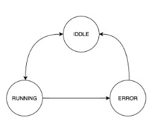

# (24) Finite State Machines
## Data Diri
Nomor Urut : 1_009FLB_38  
Nama : Farischa Makay

## Summary
### Finite State Machine
Finite state machine adalah mesin yang memiliki sejumlah state yang tiap statenya menunjukkan apa yang terjadi sebelumnya. Dapat diilustrasikan pada diagram berikut :  
  
Terdapat 3 state yang menunjukkan kejadian dalam suatu proses : IDDLE(state saat tidak terjadi proses), RUNNING(state saat proses sedang berjalan), dan ERROR(state saat proses gagal diselesaian) 
Contoh case ketika program sukses : State IDDLE berubah menjadi RUNNING saat proses berjalan dan state Running kembali menjadi IDDLE saat proses selesai.  
Contoh case ketika program gagal : State IDDLE berubah menjadi RUNNING saat proses berjalan kemudian state RUNNING menjadi ERROR saat terjadi kegagalan state ERROR kembali menjadi state IDDLE.  

### Widget with Finite State
Impelementasi finite state berfungsi sebagai informasi yang dapat berguna untuk menentukan seperti apa tampilan yang dimunculkan. Contoh case apabila kita sedang berada pada state yang menunjukkan RUNNING, maka yang ditampilkan ialah progress indicator. Apabila widget berhasil menampilkan data maka kita sekarang berada pada state IDDLE, dan jika yang ditampilkan adalah pesan yang menunjukkan bahwa proses tidak dapat diselesaikan maka state kita saat ini menunjukkan ERROR.

### Impelementasi Finite State pada view-model
Pertama kita menambahkan enum untuk masing-masing state : none saat IDDLE, loading saat RUNNING, dan error saat ERROR. Setelaj itu kita dapat membuat getter-setter untuk menyimpan state dari widget.

