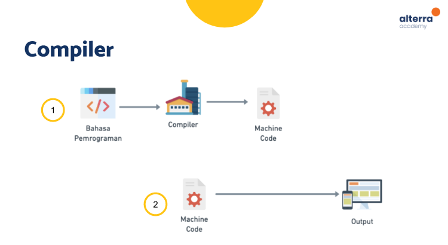
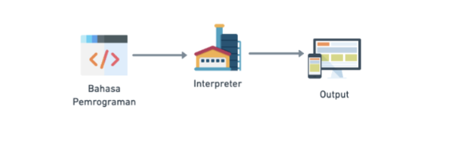

# (03) Basic Version and Branch Management
## Data Diri

Nomor Urut  : 1_009FLB_38  
Nama        : Farischa Makay  

## Summary 

 Pada section 4 ini saya belajar mengenai Introduction Mobile App Development. Pada section ini saya belajar mengenai pengertian dari Software itu sendiri. Software adalah perangkat lunak yang tersimpan dan dapat dikendalikan pada sistem komputer. Software terbentuk dari perintah-perintah dan tidak memiliki bentuk fisik. Jenis-jenis software ada 3 yakni Web, Desktop dan juga Mobile.  
- Web, software web diakses menggunakan web browser(penjelajah web) melalui suatu jaringan seperti Internet atau intranet.    
- Desktop, software yang mampu beroperasi secara offline, tetapi kita harus menginstalnya sendiri pada laptop atau komputer.  
- Mobie, software yang mampu berjalan pada perangkat mobile (smartphone atau table) dan dapat dijalankan tanpa memerlukan internet, tetapi kita perlu melakukan instalasi dan instalasi dapat dilakukan melalui store penyedia aplikasi. 

Dalam pengembangan software, aplikasi dibangun dengan menggunakan **Bahasa Pemrograman**, bahasa perograman. Bahasa pemrograman adalah rangkaian teks yang digunakan untuk memberi perintah kepada komputer. Untuk membaca Bahasa pemrogragraman bisa mengunakan software sebagai compiler atau interpreter.  

Compiler akan membaca perintah-perintah dalam bahasa pemrograman dan mengubahnya ke bahasa lain, biasanya ke dalam bentuk yang dikenali oleh komputer, seperti machine code. Machine code adalah kumpulan instruksi yang hanya dikenali oleh mesin. 
Proses kerja Compiler :  

Berbeda dengan compiler, interpreter membaca perintah-perintah dalam bahasa pemrograman dan menjalankan langsung perintah-perintah tersebut.
  Proses kerja Interpreter :  
 
 
Keunggulan dari Interpreter ialah progresnya lebih singkat namun seringkali lambat karena harus membaca ulang keseluruhan kode, sedangkan pada compiler program dapat dijalankan lebih karena tidak membaca kode.  

Untuk Mobile Development, Mobile App Development dibagi menjadi 2 yakni iOS dan Android :  
**Aplikasi iOS** adalah sistem operasi perangkat lunak yang dikembangkan oleh Apple, secara khusus untuk mendukung pengoperasian produk mobile device atau perangkat genggam. Ekstensi file dari iOS adalah .ipa
 

**Aplikasi Android** adalah software untuk perangkat mobile yang mencakup sistem operasi. Android awalnya dikembangkan oleh Android, Inc. namun sekarang berkembang luas karena open source. Ekstensi file dari android adalah .apk  
  

