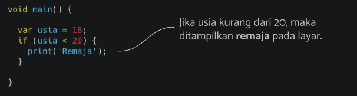
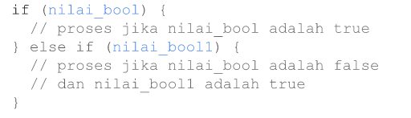
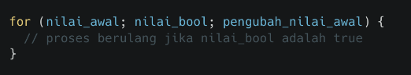
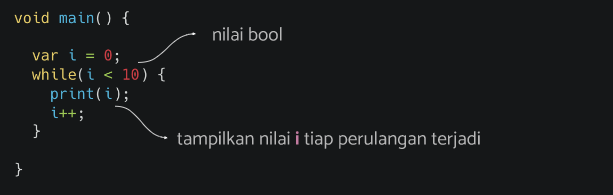
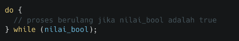
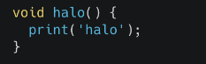
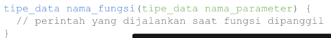
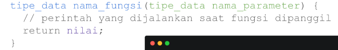

# (07) Branching, Looping, Function
## Data Diri
Nomor Urut  : 1_009FLB_38 <br>
Nama        : Farischa Makay <br>

## Summary 
### Branching
Percabangan (branching) adalah salah satu bentuk kontrol program. Percabangan berguna untuk mengatur alur jalannya program sesuai dengan suatu kondisi yang terpenuhi. Terdapat 3 keywords percabangan pada dart yakni If, else if dan else. <br>
**- IF** <BR>
 Bentuk percabangan ```if``` digunakan untuk memutuskan apakah suatu pernyataan atau blok pernyataan tertentu akan dieksekusi atau tidak, jika kondisi tertentu benar maka blok pernyataan dieksekusi, namun jika salah maka tidak akan dieksekusi. if hanya memiliki 1 blok pilihan yang akan dieksekusi jika kondisi bool true. Contohnya sebagai berikut :
 
 Dari kode diatas usia bernilai benar kurang dari 20 sehingga layar akan mengeksekusi kondisi if dengan menampilkan output "Remaja" 
 <br>

**- ELSE IF** <br>

  Bentuk percabangan ini digunakan untuk pengambilan keputusan jika kondisi if di atasnya bernilai SALAH atau FALSE, maka akan melakukan pengecekan tambahan pada kondisi kedua yang berada setelah else if. Jika kondisi kedua bernilai TRUE maka else if akan dijalankan.

**- ELSE** <BR>
  Bentuk percabangan ini digunakan untuk pengambilan keputusan jika kondisi if di atasnya bernilai SALAH atau FALSE dan pengecekan tambahan pada kondisi kedua yang berada setelah else if, jika bernilai SALAH atau FALSE makan akan menjalankan kondisi ELSE. <BR>

### LOOPING
Perulangan (Looping) adalah proses dimana akan menjalankan proses secara berulang kali hingga suatu kondisi tercapai. Jenis-jenis looping antara lain for, while dan do-while loop. <br>
**- For** <br>

Perulangan ini baik digunakan jika kita mengetahui seberapa banyak kita akan menjalankan bagian dari kode tersebut oleh karena itu perlu diketahui berapa lama perulangan terjadi, memerlukan nilai awal, memerlukan nilai bool, jika true maka perulangan dilanjutkan, dan juga memerlukan pengubah nilai. <br>
**- While** <br>

Perulangan ini digunakan untuk mengulang kode tertentu sebanyak waktu yang tidak diketahui, hingga suatu kondisi terpenuhi dan memerlukan nilai bool, jika true maka perulangan dilanjutkan. <br>
**- Do While** <br>

Perulangan ini digunakan untuk mengeksekusi kode paling tidak sekali dan kemudian secara berulang menjalankan kodenya atau tergantung pada kondisi Boolean nya untuk menjalankan kodenya diakhir. <br>
**Break dan Continue** <br>
Break dan continue adalah  cara lain untuk menghentikan perulangan dengan mengabaikan nilai boolean. Break adalah cara untuk menghentikan seluruh proses perulangan dan Continue adalah cara untuk menghentikan satu kali proses perulangan. <br>

### Function 
Fungsi adalah kumpulan kode yang dapat digunakan secara berulang-ulang, cukup memanggil fungsi yang telah telah dibuat. Untuk membuat sebuah fungsi pada dart dapat kita dapat membuat fungsi tanpa parameter, contoh code : <br>
 <br>
Fungsi dengan parameter(mengirim fungsi saat menjalankan fungsi) <br>
 <br> 
Fungsi dengan return (memberi nilai pada fungsi saat dipanggil) <br>



