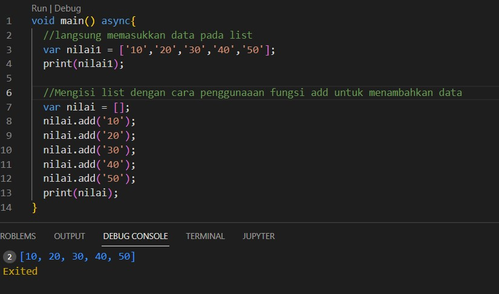
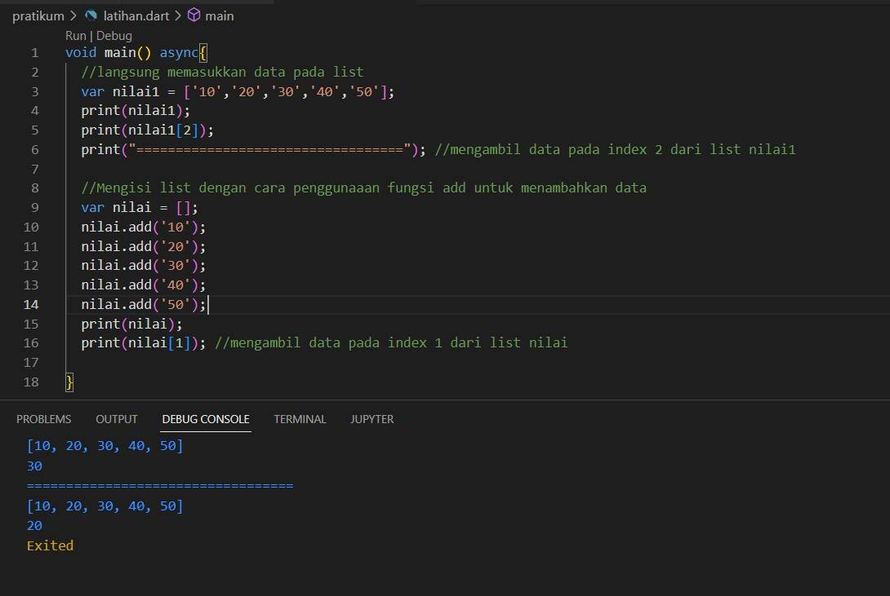
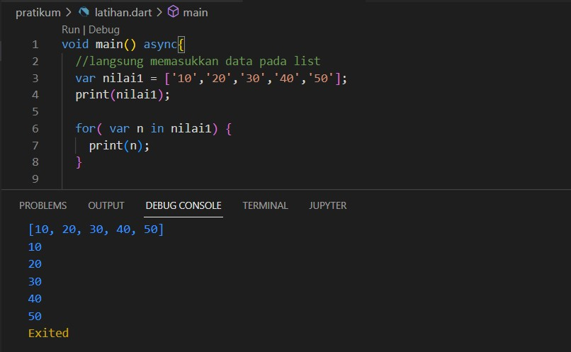
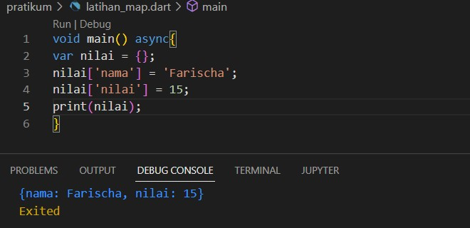
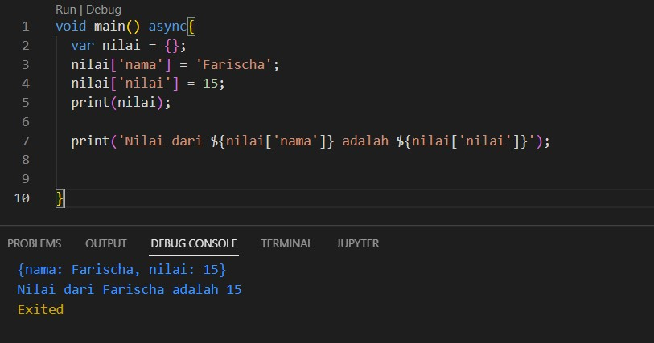
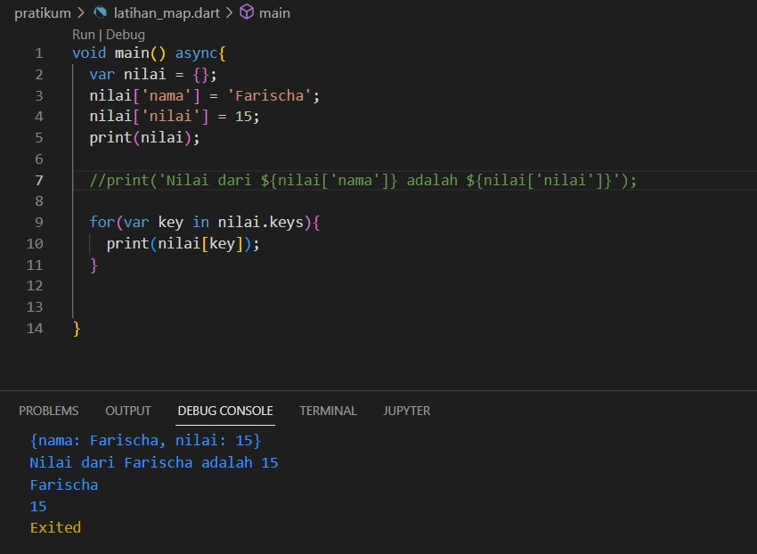

# (09) Collection
## Data Diri
Nomor Urut : 1_009FLB_38 <br>
Nama : Farischa Makay <br>
## Summary
Pada section 09 ini saya belajar mengenai Collection. Collection adalah struktur data yang lebih canggih untuk menangani masalah yang lebih complex. Collection dapat menyimpan kumpulan data pada satu tempat. Contoh collection yang dibahas pada section 08 adalah List dan Map. <br>

### List
List dapat menyimpan data secara berbaris dan setiap data di dalamnya memiliki index, dimana index dimulai dari 0. <br>
cara membuat list yaitu membuat ```[]``` pada variabel yang di deklarasikan. Untuk mengisi list kita dapat mengisi langsung ataupun menambahkan data dengan fungsi ```.add()```<br>
 <br>
Untuk mengambil data, kita dapat memangggil dengan cara mengambil data berdasarkan indexnya. contoh sebagai berikut : <br>
 <br>
Pada gambar diatas kita telah mengetahui cara mengambil data dari list secara spesifik, namun apabila kita ingin mengambil semua data yang berada pada list kira bisa menggunakan perulangan seperti ```for```. Berikut contohnya :
 <br>
Pada gambar diatas, untuk mengambil data kita menggunakan perulangan for dan membuat variabel untuk mengakses data yang ada pada list. Kemudian, mencetak data yang ada pada list. 


### Map
Jenis collection map menyimpan datanya format key-value dimana key berfungsi selayaknya index pada list yang memiliki value tiap masing-masing key. Cara membuat map yaitu dengan membuat ```{}``` kemudian di dalamnya bisa disimpan data berbentuk key-value. Contohnya sebagai berikut : <br>
 <br>
Pada data diatas diketahui bahwa key nya adalah nama dan nilai dan masing-masing key memiliki value, dimana value nama yaitu Farischa dan value nilai yaitu 15. 
Untuk mengambil nilai dari Map kita dapat mengambil dari index keynya seperti berikut ini : <br>
 <br>
Pada Map kita juga dapat mengambil seluruh data dengan menggunakan perulangan ```for``` namun dengan cara menggunakan key pada data. Contoh sebagai berikut : <br>

